# Importing Builder Bots into CloSim

This guide explains how to import a working Builder Bot / MoSimBuilder robot prefab into CloSim and convert it into a CloSim-compatible robot. The goal is for the robot to appear in CloSim's robot selection menu, spawn correctly in the correct game scene, use CloSim's command/control scheme, and support CloSim-specific features such as bumper color swapping, team icons, previews, region-limited aiming, and season-specific mechanisms.

Video version can be found here: https://youtu.be/iCTa6-AazQw

> **Important:** Import only robot assets. Do **not** import Builder/MoSimBuilder scripts into CloSim. CloSim already contains its own runtime scripts. Importing old scripts can create duplicate classes, missing-reference errors, or behavior mismatches.

---

## Prerequisites

Before starting, you need:

- CloSim opened in **Unity 2023.2.22f1**.
- The CloSim code from the GitHub repository.
- A working Builder Bot prefab.
- The robot's custom FBX files, custom materials, textures, and the robot prefab.
- No imported Builder/MoSimBuilder scripts.

A converted robot is easiest to debug if the original Builder Bot prefab works before the conversion starts. Duplicate the original prefab first so the source version remains unchanged.

---

## Expected `Resources` Folder Layout

CloSim uses Unity `Resources` folders for robot discovery and related runtime assets. Keep the folder structure consistent.

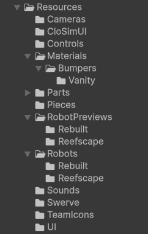

Common paths:

```text
Assets/Resources/Robots/Rebuilt/
Assets/Resources/Robots/Reefscape/
Assets/Resources/RobotPreviews/Rebuilt/
Assets/Resources/RobotPreviews/Reefscape/
Assets/Resources/TeamIcons/
Assets/Resources/Materials/
Assets/Resources/Materials/Bumpers/Vanity/
```

For now, CloSim supports robot folders for `Rebuilt` and `Reefscape`. More game folders may be added later.

---

## 1. Import the Robot Assets

Import only these asset types:

- Custom robot FBX files.
- Custom materials.
- Custom textures.
- Sprite assets such as team icons and robot previews.
- The robot prefab.

Do **not** import scripts.

After import, fix any missing material references on the prefab and confirm the model hierarchy still matches the original Builder Bot.

---

## 2. Move Materials into `Resources`

Move any imported robot materials from:

```text
Assets/Materials/
```

into:

```text
Assets/Resources/Materials/
```

If a material is used for vanity bumpers, move it to:

```text
Assets/Resources/Materials/Bumpers/Vanity/
```

The vanity bumper material must be renamed to the **exact robot prefab name**.

Example vanity bumper materials:

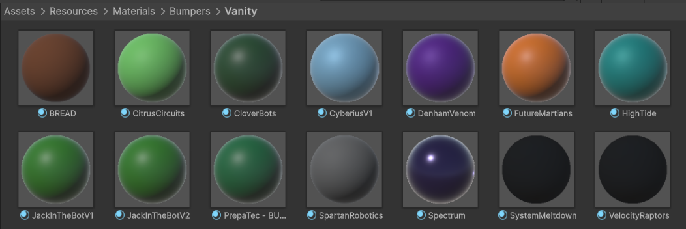

Correct example:

```text
Robot prefab name: CloverBots
Vanity material name: CloverBots
Path: Assets/Resources/Materials/Bumpers/Vanity/CloverBots.mat
```

If the material name does not exactly match the robot prefab name, CloSim will not find it as that robot's vanity bumper material.

---

## 3. Rename and Move the Robot Prefab

Rename the robot prefab to the team name or a clear team identifier. Then move it into the game-specific robot folder.

For Rebuilt robots:

```text
Assets/Resources/Robots/Rebuilt/<RobotPrefab>.prefab
```

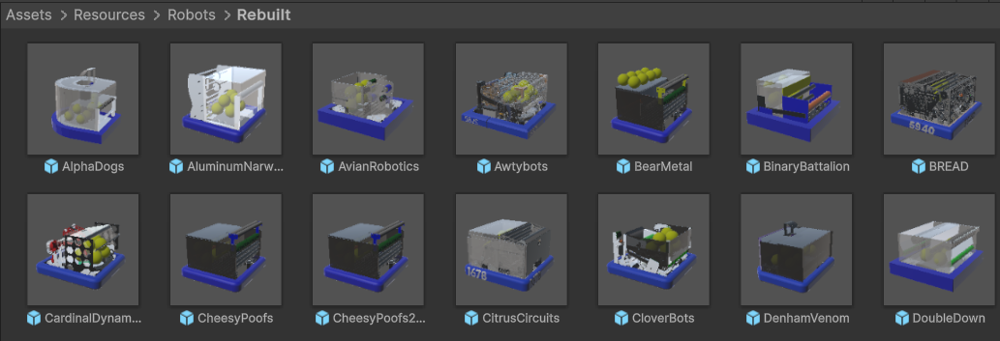

For Reefscape robots:

```text
Assets/Resources/Robots/Reefscape/<RobotPrefab>.prefab
```

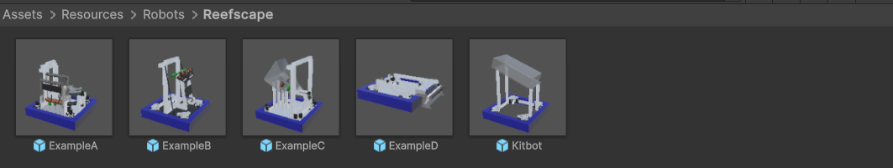

The prefab must be in the correct `Resources/Robots/<Game>` folder. If it is outside that folder, CloSim will not discover it for that game.

---

## 4. Add `RobotIdentity`

Add the `Robot Identity` script to the robot prefab root.

Set:

- `Team Number`
- `Display Name Override`
- `Team Icon`
- `Robot Preview`

Example:

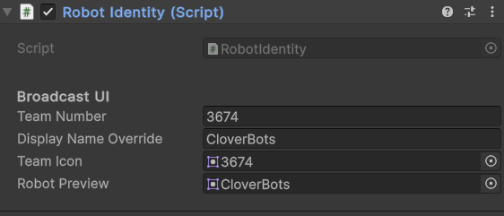

### Team Icon

Download or import the team's icon into:

```text
Assets/Resources/TeamIcons/
```

Rename the icon to the team number when possible.

Example:

```text
Assets/Resources/TeamIcons/3674.png
```

For imported image files, set:

- `Texture Type`: `Sprite (2D and UI)`
- `Sprite Mode`: `Single`

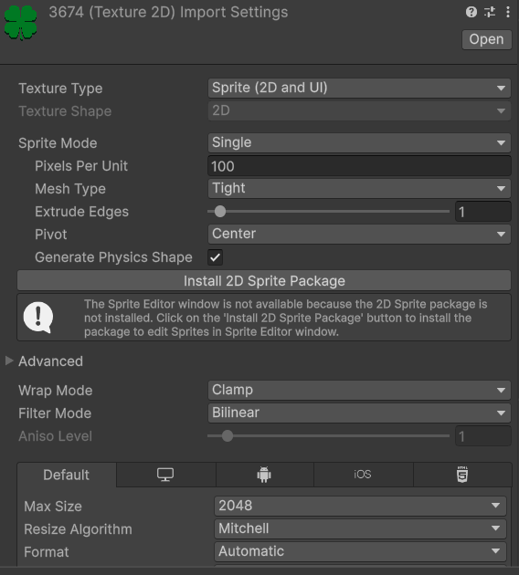

### Robot Preview

Take a screenshot/render of the robot and import it into the game-specific robot preview folder.

For Rebuilt:

```text
Assets/Resources/RobotPreviews/Rebuilt/
```

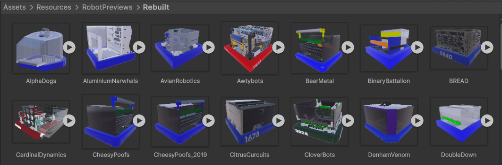

For Reefscape:

```text
Assets/Resources/RobotPreviews/Reefscape/
```

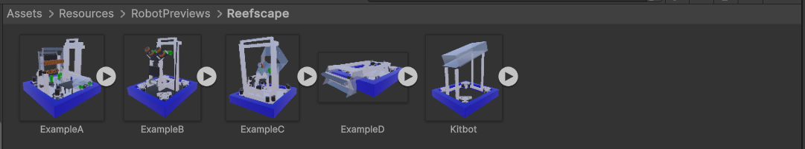

Use either the team number or team name as the preview filename.

For imported preview images, set:

- `Texture Type`: `Sprite (2D and UI)`
- `Sprite Mode`: `Single`

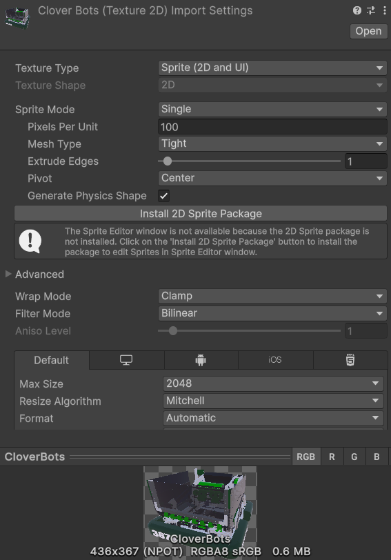

Assign the imported preview sprite to `Robot Identity > Robot Preview`.

When in doubt, compare against an already imported CloSim robot from the same game.

---

## 5. Set Up Custom Bumpers

If the robot uses a custom bumper model, move the bumper model or bumper models under:

```text
<RobotPrefabName>/drivetrain/bumpers
```

Example hierarchy:

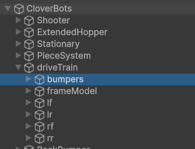

This allows CloSim to change bumper colors correctly.

If the bumper model includes team numbers printed or modeled on the bumper:

1. Duplicate the bumper model.
2. Move the duplicate outside `bumpers`, but keep it inside the drivetrain root.
3. Set the duplicate scale slightly higher than the original so the number surface does not z-fight.
4. Remove the main bumper color/material from the duplicate.
5. Leave only the number material/color visible.

Recommended structure:

```text
<RobotPrefabName>
└── drivetrain
    ├── bumpers
    │   └── recolorable bumper model
    └── bumper number model
```

Use `bumpers` or the equivalent bumper collider/visual root whenever a script asks for a bumper root. Avoid using the full robot root unless absolutely necessary, because scanning the entire robot collider hierarchy can add significant lag.

---

## 6. Rebuilt-Specific Setup

For Rebuilt robots, add the `Launch Zone Penalty` script.

Set:

- `Bumper Root` to `bumpers`, or whatever GameObject root contains the bumper colliders.
- `Blue Aim Region` to `Blue Alliance`.
- `Red Aim Region` to `Red Alliance`.
- Penalized pieces as needed, usually `Fuel` for Rebuilt.

Example:

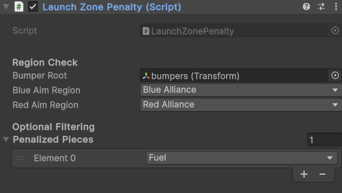

You can use the robot root as the bumper root if needed, but this is not recommended because it can add significant lag.

---

## 7. Reefscape-Specific Setup

For Reefscape robots, add the `ClimberComponent` to the root GameObject where the climber is attached.

Example climber hierarchy:

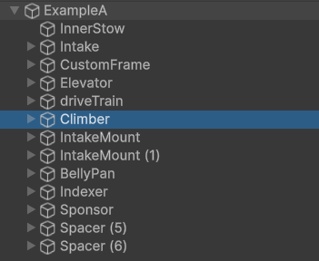

Example `ClimberComponent` placement:

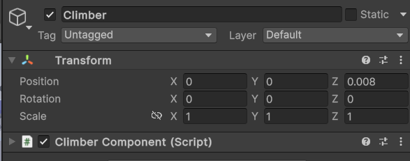

Do not automatically place the climber component on the overall robot root unless the climber is actually rooted there.

---

## 8. Convert Builder Controls to CloSim Commands

CloSim uses a different command scheme than Builder. This is usually the longest part of the conversion.

You must check each relevant mechanism script and reset its command fields to CloSim commands. Common scripts to check include:

- `AutoAim`
- `AutoAlign`
- `BuildArm`
- `BuildElevator`
- `BuildNode`

Use commands appropriate for the robot's season.

### Rebuilt Commands

```csharp
Shoot
Intake
PassLeft
PassRight
Hub
RobotSpecial
HumanPlayerDump
```

### General Commands

```csharp
FlipCamera
Restart
Menu
```

### Reefscape Commands

```csharp
AutoAlign
L1
L2
L3
L4
Barge
AlgaeHigh
AlgaeLow
AlgaeHold
Climb
```

### Command Usage Table

| Command | Typical use |
|---|---|
| `Shoot` | Rebuilt/Reefscape shoot command. |
| `Intake` | Intake, stow, or intake setpoint command depending on the robot. |
| `PassLeft` | Rebuilt left pass command. |
| `PassRight` | Rebuilt right pass command. |
| `Hub` | Rebuilt hub aiming or hub shot command. |
| `RobotSpecial` | Robot-specific extra action. |
| `HumanPlayerDump` | Rebuilt human player dump action. |
| `FlipCamera` | General camera toggle. |
| `Restart` | General restart/reset command. |
| `Menu` | General menu command. |
| `AutoAlign` | Reefscape auto-align command. |
| `L1` | Reefscape level 1 command. |
| `L2` | Reefscape level 2 command. |
| `L3` | Reefscape level 3 command. |
| `L4` | Reefscape level 4 command. |
| `Barge` | Reefscape barge command. |
| `AlgaeHigh` | Reefscape high algae command. |
| `AlgaeLow` | Reefscape low algae command. |
| `AlgaeHold` | Reefscape algae hold command. |
| `Climb` | Reefscape climb command. |

Example Reefscape `BuildElevator` command setup:

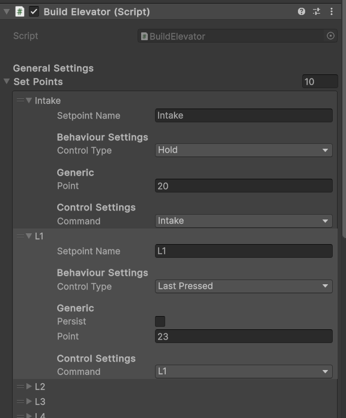

Example Rebuilt `BuildElevator` command setup:

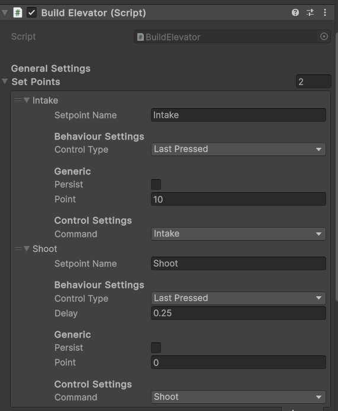

Every mechanism that previously listened for a Builder control must be checked and mapped to the correct CloSim command.

---

## 9. Configure Aiming Region Filtering (Rebuilt Only)

For `AutoAim` and `BuildArm` components used to aim at the hub, enable region filtering.

Set:

- `Require Inside Region`: enabled
- `Bumper Root`: the bumper collider root, usually `bumpers`
- `Allowed Regions`: two elements
  - `Blue Alliance`
  - `Red Alliance`

Example `AutoAim` setup:

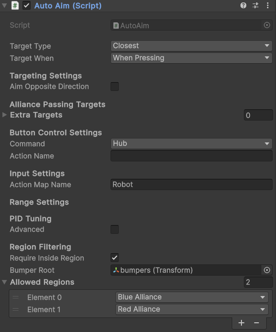

You can use the same approach for passing. If you do not want full-field passing, set the allowed region to the neutral zone or the intended passing zone.

---

## 10. Validate the Robot in CloSim

After conversion, test the robot inside CloSim.

Minimum validation:

- The robot prefab appears in the correct `Resources/Robots/<Game>` folder.
- The robot appears in the robot selection menu.
- The robot tile shows the correct preview image.
- The robot tile shows the correct team number/name.
- The robot spawns in the selected game scene.
- The robot starts on the correct alliance side.
- Bumper colors change correctly.
- Vanity bumpers work if the robot has a vanity bumper material.
- The robot drives correctly.
- The robot faces the correct direction at spawn.
- The robot mechanisms respond to the expected commands.
- Rebuilt hub/passing aim works only in the intended regions.
- Reefscape climber behavior works if the robot has a climber.
- No red console errors appear during robot selection, spawn, or match start.

If the robot faces backward at spawn, check the game scene's `LoadMatch` settings and add the robot prefab name to the `robotsToFlipSpawn180` list if needed.

---

## Troubleshooting

| Problem | Likely cause | Fix |
|---|---|---|
| Robot does not appear in robot selection | Prefab is in the wrong folder | Move it to `Assets/Resources/Robots/Rebuilt/` or `Assets/Resources/Robots/Reefscape/`. |
| Robot appears with the wrong name | `RobotIdentity` is missing or not configured | Add `RobotIdentity`, then set team number and display name. |
| Robot preview is missing | Preview is not assigned or image was not imported as a sprite | Set `Texture Type` to `Sprite (2D and UI)`, `Sprite Mode` to `Single`, and assign it to `Robot Preview`. |
| Team icon is missing | Icon is not assigned or image was not imported as a sprite | Import the icon into `Assets/Resources/TeamIcons/`, set it to Sprite, and assign it in `RobotIdentity`. |
| Vanity bumper material does not apply | Material is in the wrong folder or has the wrong name | Move it to `Assets/Resources/Materials/Bumpers/Vanity/` and rename it to exactly match the robot prefab. |
| Bumpers do not recolor | Bumper model is not under the bumper root | Move the recolorable bumper model under `<RobotPrefabName>/drivetrain/bumpers`. |
| Bumper numbers recolor incorrectly | Number mesh is part of the recolored bumper mesh | Duplicate/separate the number mesh and keep it outside the recolored `bumpers` object. |
| Robot controls do not work | Commands still use Builder values or scripts were not remapped | Check `AutoAim`, `AutoAlign`, `BuildArm`, `BuildElevator`, and `BuildNode` command fields. |
| Rebuilt hub aiming works from invalid areas | Region filtering is disabled or regions are missing | Enable `Require Inside Region`, assign bumper root, and add `Blue Alliance` and `Red Alliance`. |
| Rebuilt causes lag during region checks | Bumper root is set to the whole robot | Use the specific bumper collider root instead of the robot root. |
| Reefscape climber does not work | `ClimberComponent` is on the wrong object or missing | Add it to the root object where the climber is attached. |
| Robot spawns backward | Spawn rotation differs from CloSim's expected direction | Add the robot prefab name to `robotsToFlipSpawn180` in the game scene's `LoadMatch`. |
| Console has missing script errors | Builder scripts were imported or script references remained on prefab | Remove missing/imported Builder scripts and use CloSim scripts only. |